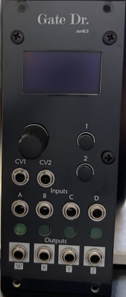

# Gate Dr. 

The Gate Doctor is a multi-functional logic, comparator, and gate manipulation module in the Eurorack synth format.

The module is based around extracting, combining, and further modulating gate signals from your Eurorack system. It can be a simple comparator, logic module, clock divider, probability generator, gate delay (plus plenty of other features/modulation options), or many combinations of those at once!

The module consists of 2 channels, each with 2 inputs and 2 outputs, and 2 global CV inputs that can be routed to almost any parameter in the module. Each input is fed into a comparator with adjustable threshold (or assign it to CV)- each pair of channel inputs are then fed to 2 different logic gates (including a 'Bypass' that will send the comparator result to the Output section below it). The results of the logic operations are then fed into the Output section where the signal can be fed through a variety of gate-centric utilities, such as a clock divider, probability mask, gate delay, and more. 

As you can probably see already (and please read the manual in /GateDr/documentation/ to see all the other features it has!), the Gate Dr. is a very flexible utility tool designed to be able to create, combine, and fine-tune gate signals to send out to the rest of your Eurorack system. Whether you are extracting gates from LFOs, combining multiple gate sequencers and probability to create new generative sequences, or simply trimming a gate signal's length to make it play well with a module that wants short triggers, you may not need every feature it has on a given patch but it can find a place in nearly every patch you make <3

NOTE: The Gate Dr. is designed for control signals, not audio rate signals. However, you are highly encouraged to abuse this fact to create some unique glitchy digital textures.

# Feature List

Each channel in the Gate Dr. contains:

>   2 comparators with adjustable threshold, hysteresis, and ability to invert the signal.

>   2 separate logical operations on the 2 inputs, including combinational logic (AND, NAND, OR, NOR, XOR, XNOR), sequential logic (S-R latch, D-latch), and a BYPASS operation which ignores the 'operation' processing.

>   Output processing blocks that include various gate-related utilities, including a clock divider, a gate start-delay, a probability control, and a robust gate-to-trigger converter.

>   2 globally assignable CV signals, with CV control available for the vast majority of parameters.

The Gate Dr. also has the following features:

>   OLED screen, pushbutton encoder, and two Channel buttons for easy access to any parameter. 

>   Simple, easy to understand menu interface with shortcuts to menus on the panel. 

>   Automatic saving of all settings parameters. 

>   Reverse power protection. 

>   Super slim skiff-friendly design. 

>   USB-Micro Type B connection for easy drag-and-drop firmware updates. 

## Repo info

This repository contains the hardware design files and firmware for the Gate Dr. module, as well as associated documentation (manual, licenses, BOM, etc.).

## Build info

This firmware was built using Microchip Studio, and contains all relevant source files, third party dependencies, and associated Microchip Studio files for compilation. The repository also contains .uf2 files for uploading directly to the module. 

The hardware was designed using KiCad and the repository contains all relevant KiCad files for the main board, OLED display board, and front panel. 